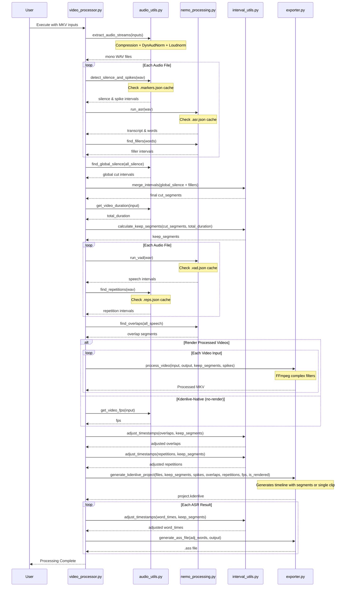

# Video Processing Tool

A modular Python tool for synchronized multi-video editing based on audio stream analysis. Optimized for Hungarian language processing and NVIDIA 3060 GPUs.

## Operation Sequence



## Features

- **High-Quality Signal Processing**: Automatically applies compression, dynamic normalization, and targets -14 LUFS to all audio streams for consistent levels.
- **Fast Execution via Caching**: Metadata (ASR, VAD, repetitions, silence) is cached in JSON files, allowing near-instant re-runs if analysis parameters haven't changed.
- **Standalone Audio Support**: Handles `.mp3`, `.wav`, and `.m4a` files. If standalone audio is provided with video files, on-camera audio is ignored during analysis.
- **Kdenlive-Native Editing**: Optionally avoids re-encoding by generating a Kdenlive timeline with virtual segments from original files using the `--no-render` flag.
- **Synchronized Multi-Stream Cutting**: Processes multiple inputs simultaneously, maintaining perfect sync across all tracks.
- **Silence Detection**: Automatically cuts segments where all audio streams are below -30dB (default) for more than 2 seconds.
- **Spike Muting**: Identifies and mutes minor audio spikes (clicks, coughs) under 0.2s.
- **Hungarian Filler Detection**: Uses NVIDIA Parakeet TDT ASR to find and cut "er" and "ő" filler sounds.
- **Overlap Marking**: Identifies active discussions (>=5s) on multiple streams and marks them as Guide regions in Kdenlive.
- **Repetition Detection**: Identifies repeated phrases or sounds using acoustic similarity (MFCC-based).
- **ASR Subtitles**: Generates `.ass` subtitle files for ASR transcriptions with timestamps adjusted for the final edit.

## Modular Structure

- `video_processor.py`: Main entry point, CLI logic, and batch orchestration.
- `audio_utils.py`: Audio extraction, signal processing, silence/spike/repetition detection using `librosa`.
- `nemo_processing.py`: NVIDIA NeMo integration for VAD and ASR.
- `interval_utils.py`: Mathematical logic for merging, inverting, and adjusting time intervals.
- `exporter.py`: FFmpeg processing and file generation (Kdenlive XML, ASS).

## Prerequisites

- [Python 3.10+](https://www.python.org/)
- [uv](https://github.com/astral-sh/uv) (for environment and package management)
- [FFmpeg](https://ffmpeg.org/) and `ffprobe` (must be in system PATH)
- NVIDIA GPU with CUDA support (e.g., RTX 3060)

### Installation

#### Windows (Recommended)
Simply run `setup.bat`. This will create a virtual environment, install PyTorch with CUDA support, and all dependencies using `uv`.

#### Linux/macOS
Using `uv`:
```bash
uv venv
source .venv/bin/activate
uv pip install -r requirements.txt
```

### Usage

#### Basic Command
Use `process.bat` with a file or a directory:
```batch
process.bat "C:\MyRecording\Source" --video-offsets 0.5
```

#### Advanced Options
- `--no-render`: Generates the Kdenlive project using original files (lossless and fast).
- `--video-offsets`: Comma-separated or single value in seconds (e.g., `1.2` or `0.5,-0.2,0`) to align tracks.
- `--silence-threshold`: Set dB level for silence (default: `-30.0`).
- `--filler-words`: Comma-separated list of Hungarian filler words to cut (default: `er,ő`).

### Automatic File Discovery
When a directory is provided, the tool automatically finds:
- **Video**: `.mkv`, `.mp4`, `.avi`
- **Audio**: `.mp3`, `.wav`, `.m4a`

### Directory Structure
- **Working Directory**: The tool creates a `video_processing_work` folder in the **parent directory** of your input source to store cache files (`.asr.json`, etc.) and extracted audio.
- **Output Position**: Rendered videos and the `project.kdenlive` file are placed in the **parent directory** of the input source.

## Project Output

The `video_processing_work` directory will contain:
- Extracted and normalized mono WAV files.
- Transcribed `.ass` files.
- A `project.kdenlive` file ready for further editing.
- Cache files: `*.markers.json`, `*.asr.json`, `*.vad.json`, `*.reps.json`.
