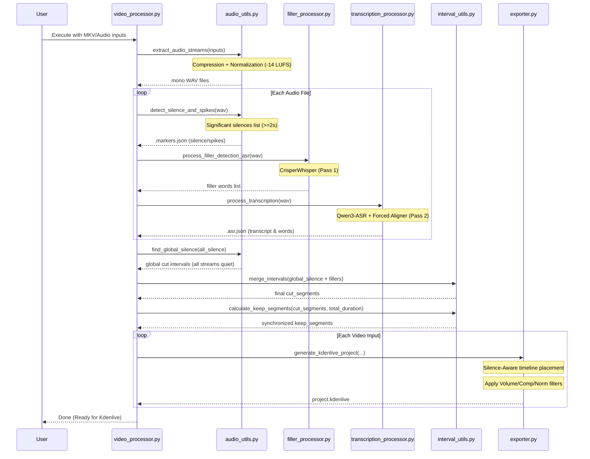

# Video Processing Tool

A modular Python tool for synchronized multi-video editing based on audio stream analysis. Optimized for Hungarian language processing and NVIDIA 3060 GPUs.

## Operation Sequence



## Features

- **Dual-Pass ASR Pipeline**: 
    - **Pass 1 (Filler Detection)**: Uses `nyrahealth/CrisperWhisper` via `faster-whisper` for high-speed precision detection of speech boundaries and fillers.
    - **Pass 2 (High-Fidelity Transcription)**: Uses `Qwen3-ASR-1.7B` with `Qwen3-ForcedAligner` for state-of-the-art Hungarian transcription and word-level timestamp accuracy.
- **VRAM Optimizations**: Orchestrated to stay within 8GB VRAM (RTX 3060). Pass 1 uses `int8_float16` quantization; Pass 2 uses `bfloat16`.
- **Precision Timestamps**: Re-maps transcript timestamps from unified audio back to the original timeline with millisecond precision.
- **High-Quality Signal Processing**: Automatically applies compression and targets -14 LUFS for consistent levels across all streams.
- **Fast Execution via Caching**: Metadata (ASR, repetitions, silence) is cached in JSON files for instant re-runs.
- **Silence-Aware Export**: Kdenlive project generator matches ASR logic, skipping long silences (>=2s) to create a clean, synchronized multi-track timeline.
- **Automatic Audio Filters**: Every audio clip on the Kdenlive timeline automatically receives high-quality Compressor, Limiter, and Loudness Normalization filters.
- **Filler Detection**: Automatically identifies and cuts Hungarian/English filler words like `[UH]`, `[UM]`, `er`, and `ő`.
- **Overlap & Repetition Detection**: Highlights active discussions and marks duplicate acoustic patterns for easy editing.
- **ASR Subtitles**: Generates synchronized `.ass` and `.srt` files with timestamps adjusted for the final cut.

## Modular Structure

- `video_processor.py`: Main entry point, CLI logic, and batch orchestration.
- `audio_utils.py`: Audio extraction, signal processing, silence/spike/repetition detection using `librosa`.
- `filler_processor.py`: Speech boundary detection and filler word identification using CrisperWhisper.
- `transcription_processor.py`: Main ASR engine for high-fidelity transcription using Qwen3-ASR.
- `interval_utils.py`: Mathematical logic for merging, inverting, and adjusting time intervals.
- `exporter.py`: FFmpeg processing and file generation (Kdenlive XML, ASS).

## Prerequisites

- [Python 3.10+](https://www.python.org/)
- [uv](https://github.com/astral-sh/uv) (for environment and package management)
- [FFmpeg](https://ffmpeg.org/) and `ffprobe` (must be in system PATH)
- NVIDIA GPU with CUDA support (e.g., RTX 3060)

## Dataset Setup (Optional but Recommended)

For advanced filler word detection, this tool uses a custom CNN model. To train or re-train this model, you need the **PodcastFillers** dataset:

1. **Download**: Visit [Zenodo (PodcastFillers)](https://zenodo.org/records/7121457).
2. **Files Needed**:
   - `PodcastFillers.csv`
   - `clips.tar.gz` (or the unpacked `clip_wav` folder)
3. **Structure**: Place these files into a folder named `PodcastFillerDataset` in the project root:
   ```text
   video-processing-tool/
   ├── PodcastFillerDataset/
   │   ├── PodcastFillers.csv
   │   └── clip_wav/ (folder containing .wav files)
   ```
4. **Trigger Training**: Run `setup.bat`. It will automatically detect the dataset and train the model if `filler_detector.pth` is missing.

### Installation

#### Windows (Recommended)
Simply run `setup.bat`. This will create a virtual environment, install PyTorch with CUDA support, and all dependencies using `uv`.

#### Linux/macOS
Using `uv`:
```bash
uv venv
source .venv/bin/activate
uv pip install -r requirements.txt
```

### Usage

#### Basic Command
Use `process.bat` with a file or a directory:
```batch
process.bat "C:\MyRecording\Source" --video-offsets 0.5
```

#### Advanced Options
- `--no-render`: Generates the Kdenlive project using original files (lossless and fast).
- `--video-offsets`: Comma-separated or single value in seconds (e.g., `1.2` or `0.5,-0.2,0`) to align tracks.
- `--silence-threshold`: Set dB level for silence (default: `-30.0`).
- `--filler-words`: Comma-separated list of Hungarian filler words to cut (default: `er,ő`).

### Automatic File Discovery
When a directory is provided, the tool automatically finds:
- **Video**: `.mkv`, `.mp4`, `.avi`
- **Audio**: `.mp3`, `.wav`, `.m4a`

### Directory Structure
- **Working Directory**: The tool creates a `video_processing_work` folder in the **parent directory** of your input source to store cache files (`.asr.json`, etc.) and extracted audio.
- **Output Position**: Rendered videos and the `project.kdenlive` file are placed in the **parent directory** of the input source.

## Project Output

The `video_processing_work` directory will contain:
- Extracted and normalized mono WAV files.
- Transcribed `.ass` files.
- A `project.kdenlive` file ready for further editing.
- Cache files: `*.markers.json`, `*.asr.json`, `*.vad.json`, `*.reps.json`.

## Kdenlive / MLT Reference

For MLT XML formatting rules, see [`kdenlive/README.md`](kdenlive/README.md).
