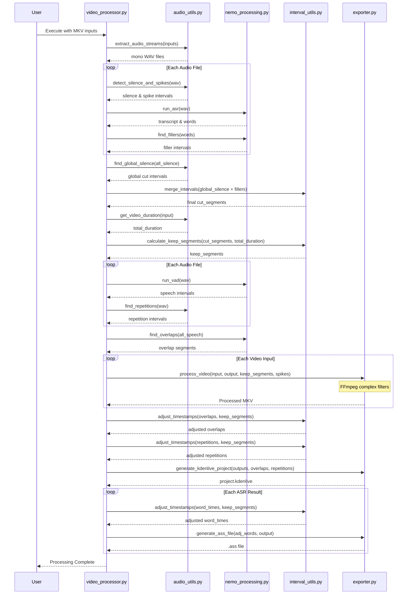

# Video Processing Tool

A modular Python tool for synchronized multi-video editing based on audio stream analysis. Optimized for Hungarian language processing and NVIDIA 3060 GPUs.

## Operation Sequence



## Features

- **Synchronized Cutting**: Processes multiple MKV inputs simultaneously to maintain perfect synchronization.
- **Silence Detection**: Automatically marks segments for cutting where all audio streams are below a threshold (default -30dB) for more than 2 seconds.
- **Spike Muting**: Identifies and mutes minor audio spikes (under 0.2s) like clicks or coughs.
- **Hungarian Filler Detection**: Uses NVIDIA Parakeet TDT ASR to find and cut "er" and "ő" filler sounds.
- **Overlap Marking**: Identifies active discussions (>=5s) on multiple streams and marks them for editing in Kdenlive.
- **Repetition Detection**: Uses acoustic similarity (MFCC-based) to find and mark repeated sounds.
- **Kdenlive Integration**: Generates a `.kdenlive` project file with colored markers (Guides) for overlaps and repetitions.
- **ASR Subtitles**: Generates `.ass` subtitle files for ASR transcriptions with adjusted timestamps.

## Modular Structure

- `video_processor.py`: Main entry point and CLI logic.
- `audio_utils.py`: Audio extraction, silence/spike/repetition detection using `librosa`.
- `nemo_processing.py`: NVIDIA NeMo integration for VAD and ASR.
- `interval_utils.py`: Mathematical logic for merging, inverting, and adjusting time intervals.
- `exporter.py`: FFmpeg processing and file generation (Kdenlive XML, ASS).

## Prerequisites

- Python 3.8+
- [FFmpeg](https://ffmpeg.org/) and `ffprobe`
- NVIDIA GPU with CUDA support (e.g., RTX 3060)

## Installation

Using `uv`:

```bash
uv venv
source .venv/bin/activate
uv pip install -r requirements.txt
```

## Usage

```bash
python video_processor.py video1.mkv video2.mkv [options]
```

### Key Parameters

- `--silence-threshold`: Silence threshold in dB (default: -30.0).
- `--silence-duration`: Minimum silence duration for cutting (default: 2.0s).
- `--overlap-duration`: Minimum duration for overlapping talk markers (default: 5.0s).
- `--filler-words`: Comma-separated filler words to cut (default: "er,ő").
- `--working-dir`: Directory for intermediate files.

## Project Output

Cuts and processing markers are performed simultaneously on all input streams. The `video_processing_work` directory will contain:
- Extracted mono WAV files.
- Transcribed `.ass` files.
- A `project.kdenlive` file ready for further editing.
